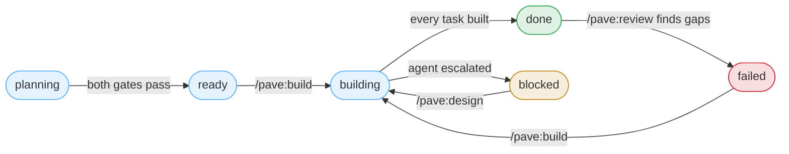

# claude-plugins

Claude Code plugins for paveforge.

```
/plugin marketplace add paveforge/claude-plugins
/plugin install pave@paveforge
```

---

# Pave

**Design a feature once across every service it touches, freeze the contracts,
then build each service in parallel.**

When a feature spans several services, the usual approach is to go service by
service, designing each in isolation. The cross-service picture — which
services are affected, what the interfaces between them are, what order things
ship in — never exists anywhere except in someone's head.

Pave inverts that. A **hub** folder sits beside your service repos and holds
the planning. A feature is designed once, across all of it, with the contracts
between services defined and generated before any implementation starts.
Freezing the contracts is what makes the next step safe: the services stop
depending on each other's in-flight code, so they can be built at the same time
by separate agents, each working from a self-contained task document.

It is stack-agnostic. Build commands are discovered per repo — CI config
first, since that says how *your team* builds *this repo* — so nothing in the
plugin assumes a language, a framework or an architecture.

`build`, `test` and `lint` are slots meaning "does this work", not literal
compilation: a Terraform repo's are `validate`, `plan` and `tflint`, and a
Helm chart's are `template`, `test` and `lint`. Services, libraries, apps and
infrastructure are all first-class.

---

## Quick start

```bash
mkdir platform && cd platform          # the hub, beside your service repos
claude
```

```
/pave:init                             # create the hub here
/pave:add ../be-user-service           # register each service
/pave:add ../be-order-service
/pave:add ../be-pricing-service
/pave:analyse                          # work out what they are, and what they do
/pave:design build checkout            # → two approval gates
/pave:build build-checkout             # fan out, one agent per service
/pave:review build-checkout            # did the agents follow the plan?
```

Then commit `config.yaml`, `CLAUDE.md`, `conventions/` and `.pave-hub` so your
team shares them. `workspace.yaml` stays local — it holds *your* repo paths,
and a teammate generates their own with `/pave:init`.

---

## The workflow

| Command | When you run it |
|---|---|
| `/pave:init` | Once, to create the hub |
| `/pave:add <folder>` | Whenever a service joins the platform |
| `/pave:analyse` | After adding services, then as they drift |
| `/pave:design` | Every new feature |
| `/pave:build` | Once the plan is approved |
| `/pave:review` | On demand |
| `/pave:help` | Any time you have a question about using Pave |
| `/pave:query` | Any time you have a question about your hub |
| `/pave:visualize` | Any time you want a picture instead of tables |

---

## `/pave:init` — create the hub

**What it does.** Creates the hub folder's scaffolding: `config.yaml`,
an empty `workspace.yaml`, `CLAUDE.md`, `conventions/` and a `.pave-hub`
marker that lets every other command find the hub from anywhere.

It does not look for repos, guess what anything is, or scan. Each step does one
thing you can check before moving on.

**What it asks you.** Where the hub goes — this folder, or somewhere else. It
never guesses. It also offers `git init` if the folder isn't a repository,
since the config split depends on version control.

---

## `/pave:add` — register a service

```
/pave:add ../be-order-service
/pave:add ../storefront/packages/events     # a monorepo package
```

**What it does.** Records the folder's absolute path in `workspace.yaml` and
adds it to `additionalDirectories` in `.claude/settings.json` — that second
part is what actually grants Claude access to the repo.

It runs `scripts/pave.sh`, because none of that needs a model: validate,
absolutise, append, merge. The script is idempotent, so adding the same folder
twice is a no-op, and you can run it directly if you prefer:

```
"$(...)/plugins/pave/scripts/pave.sh" add ../be-order-service
```

That's all it records: name and path. Not the language, not the build commands.
`/pave:analyse` finds those, and having two commands discover the same things
would mean two answers.

**What it asks you.** Nothing, unless something is wrong — the folder doesn't
exist, isn't a git repository, is inside the hub, or collides with a name
already registered.

---

## `/pave:analyse` — work out what they are

**What it does.** Two passes over the registered services.

**Discovery** reads CI config first, then a task runner, then the manifest,
then the README, and records the language, build/test/lint commands, contracts
and git root. That order is deliberate: a manifest tells you a repo is Go; CI
tells you how *your team* builds *this repo*, which is the question that
matters.

**Analysis** then reads each service's domain model, business flows,
integrations and data ownership, and writes an indexed knowledge base.

**Why the second pass exists.** Discovery records how to *build* a repo. It
says nothing about what a service *means*. Without that, design writes
confident, concrete tasks that contradict code which already exists — a
`Reservation` entity in a service that has had `StockHold` for two years.
Concrete and wrong is worse than vague, because an agent will faithfully build
it.

**It never overwrites your edits.** `workspace.yaml` is yours to correct. If
you fix a test command by hand, analyse fills empty fields around it and leaves
yours alone, reporting the disagreement instead of silently winning.

**Staleness is path-scoped, not age-based.** Each service records the commit
and the source directories its analysis rested on. A month of commits to CI
config invalidates nothing; a change under `internal/domain` invalidates
exactly one service.

That check runs in `scripts/pave.sh`, which you can also run directly:

```
pave.sh stale

undiscovered svc-d       no language in workspace.yaml
missing      svc-c       no knowledge folder
stale        svc-b       1 file(s) changed under internal/domain
orphan       old-svc     knowledge folder, no such service in workspace.yaml
current      svc-a       unchanged since 0818f6e
```

**You rarely run it by hand after the first time.** Design spawns analysts
itself for any service whose knowledge is missing or stale.

---

## `/pave:design` — plan the feature

The phase everything else depends on. It runs on the model `config.yaml`
names for the designer, spawning a `designer` agent when your session differs.

**What it does, in order:**

1. **Blast radius** — which services does this touch? Usually more than the
   person asking expects.
2. **Spec** — what and why, plus acceptance criteria for the feature as a whole
3. **Architecture** — the cross-service approach, the flow, failure behaviour,
   state ownership, and the reasoning behind each decision
4. **Contracts** — the interfaces between services

   **→ Gate 1.** You approve the spec, architecture and contracts together. An
   interface between two services is a design decision, so it is judged
   alongside the flow it serves — and the objection lands before any task
   derived from it exists. **Contracts freeze here.**

5. **Task documents** — one per unit of work, each naming a single service
6. **Readiness check** — fourteen checks; a failure blocks the fan-out

   **→ Gate 2.** One question: are these briefs executable without further
   decisions?

**Naming a feature.** The id names the folder and is how every later step
refers to the feature:

```
/pave:design DGF-8888 build checkout     →  features/DGF-8888/
/pave:design build checkout              →  features/feat-1/
```

A leading ticket reference becomes the id; otherwise `scripts/pave.sh`
allocates the next `feat-N`.
Ids are deliberately short rather than descriptive — `/pave:build DGF-8888`
has to work from a fresh session with nothing to look up, and a kebab-cased
sentence is not something anyone types twice. The description becomes the
feature's **title**, in `spec.md` and the portfolio table, so the folder list
stays readable.

If the id already exists, that's a re-design of that feature — announced
before it starts, and still gated.

**What it asks you.** To confirm the blast radius, then both gates.

**Re-designing.** `/pave:design <feature-id>` on an existing feature re-derives the
whole thing rather than patching the gap. You cannot know that only one case
was missed, and a patched design produces tasks that are each individually
reasonable and collectively inconsistent — a service handling a state its
caller never sends. That is the hardest kind of defect to see.

---

## `/pave:build` — execute the plan

**What it does.** Groups the tasks by service and fans out one agent per
service.

**Pave writes in the hub; builders write in the repos.** The skill itself never
touches a service repository — it reads the hub, spawns agents, and writes
reports back. Each builder owns exactly one repo: it creates the branch, copies
the frozen contracts in, runs codegen, commits that on its own, and then starts
work. One writer per repo is what makes parallel agents safe.

Contracts are copied, never regenerated from the spec, so every service builds
against the same bytes.

Tasks targeting the same service run sequentially in one agent — two agents in
one repo is a write conflict. Different services run in parallel.

**What it asks you.** Ideally nothing. The build report is triaged by *who must
act*: an in-scope judgement an agent made goes under **Decisions taken**, where
you can skim it; only what genuinely cannot be resolved without you reaches
**Needs you**, and each of those carries the decision and the exact command.

**Escalation.** An agent that finds the contract wrong stops rather than fixing
it locally — other services are built against that contract, and a local fix
turns one error into several divergent guesses. That becomes a decision for
you, usually a re-design.

---

## `/pave:review` — check the agents followed the plan

**What it does.** Spawns one reviewer per task. Each takes a single task
document and one repo, and finds every ticked item in the code — not in the
agent's report, in the code.

**What it does not do.** It does not verify the feature works, or ask whether
the design was right. If the plan said A, B and C and the agents did A, B and
C, it passes — even if the feature needs D. A missing case is a planning
problem, so it goes in the report as a comment and you decide.

That restraint is the point: it makes the phase cheap, and it keeps your
approval at gate 2 meaningful.

**When something deviates**, review unchecks the specific items that were not
real, marks that task `failed`, and writes a per-task report. `/pave:build`
then re-runs only the failed tasks, and each agent reads only its own section —
so a fix touches three items rather than redoing twenty.

---

## `/pave:help` — how do I use Pave

Not part of the sequence above. Run it any time, from anywhere — it needs no
hub.

```
/pave:help
/pave:help design
/pave:help how does /pave:review decide a task failed?
```

**What it does.** Explains a command, or the workflow as a whole, straight
from the plugin's own skill files — no hub, no agent, just a handful of
small local files. With no argument it lists every command and what it does
in one line. Given a command name, it explains that phase in plain language.

Ask it something about *your* hub instead — a service, a feature, a
convention — and it declines and points you at `/pave:query`, rather than
guessing at an answer it has no way to check.

**What it asks you.** Nothing.

---

## `/pave:query` — ask about your hub

Also not part of the sequence. Run it any time, once you have a hub.

```
/pave:query what does the billing service own?
/pave:query why did build-checkout end up blocked?
```

**What it does.** Spawns a `retriever` agent that reads the knowledge base,
`conventions/`, and the hub's `AGENTS.md`/`CLAUDE.md` to answer, citing the
file each fact came from.

It never invents a domain fact. If a service hasn't been analysed yet, or the
knowledge base doesn't cover what you asked, it says so and points at
`/pave:analyse` rather than guessing.

**What it asks you.** Nothing.

---

## `/pave:visualize` — draw a picture

Also not part of the sequence. Run it any time.

```
/pave:visualize build-checkout             # a feature's blast radius
/pave:visualize how does pricing talk to checkout?   # freeform
```

**What it does.** Given a feature id, draws that feature's blast radius —
services as nodes, the Flow steps and Contracts from its `architecture.md` as
edges. Given anything else, treats it as a description and pulls what's
relevant from the knowledge index.

It draws only from files other phases already wrote — never from scanning a
service repo — and says plainly when something needed is missing or stale
rather than filling the gap.

Where Claude's Artifact tool is available it publishes an interactive
diagram and gives you the link; otherwise it writes a self-contained
`diagram.html` you open locally.

**What it asks you.** What to draw, if you ran it with no argument.

---

## The hub

```
platform/
├── config.yaml              team policy — commit this
├── workspace.yaml           your services — gitignored, local to you
├── CLAUDE.md                your rules — every agent is given this
├── conventions/             how code is written, by language and service
│   ├── README.md
│   └── go.md
├── artifacts/               disposable — delete it and it regenerates
│   ├── knowledge/           what each service does, indexed
│   ├── diagram.html         written by /pave:visualize when freeform
│   └── platform.code-workspace
└── features/
    ├── README.md            portfolio: one row per feature
    └── build-checkout/
        ├── README.md        one row per task
        ├── spec.md
        ├── architecture.md
        ├── contracts/       frozen at gate 1
        ├── tasks/           one self-contained document per unit of work
        └── artifacts/       build/review reports, and diagram.html
```

`config.yaml` holds nothing machine-specific, so it commits and the team shares
it. `workspace.yaml` holds absolute paths, which differ per developer — a
teammate clones the hub and builds their own with `/pave:add`. That split is
what lets everyone share one policy with their own local layout.

---

## Status



| Status | Means | What to do |
|---|---|---|
| `planning` | Design in progress | — |
| `ready` | Both gates passed, not built | `/pave:build <feature-id>` |
| `building` | Being built, or a run left work | `/pave:build <feature-id>` resumes |
| `done` | Every task built | `/pave:review <feature-id>` if you want it checked |
| `failed` | Review found claims that were not real | `/pave:build <feature-id>` re-runs those tasks |
| `blocked` | An agent escalated | Read the build report; usually `/pave:design <feature-id>` |

---

## Configuration

`config.yaml` — team policy, committed:

```yaml
model_ranking: [haiku, sonnet, opus, fable]   # weakest to strongest

agents:
  analyst:   { model: sonnet, effort: medium }   # reads business logic
  builder:   { model: sonnet, effort: medium }   # executes one task document
  explorer:  { model: haiku,  effort: low    }   # mechanical repo scanning
  reviewer:  { model: sonnet, effort: low    }   # one per task: plan vs code
  designer:  { model: opus,   effort: high   }   # planning decides the feature
  retriever: { model: sonnet, effort: low    }   # answers hub questions

execution:
  mode: parallel                 # parallel | sequential
  monorepo_strategy: sequential  # sequential | worktree | shared-tree
  max_parallel: 4

branch:
  pattern: feature/{feature-id}

contracts:
  land_contracts: true
```

Every model is enforced when its agent is spawned, design included. Skills
look each one up with `pave.sh agent <name>` rather than parsing YAML. If your
session model differs from `designer`'s, `/pave:design` spawns a `designer`
agent on the configured model, once, and resumes it for the second stage.

`model_ranking` lives in config rather than the plugin, so a new model is one
line you add rather than a plugin release you wait for.

**Monorepos.** When several services share a repo, `monorepo_strategy` decides
whether their tasks run one at a time (default, safe), in separate git
worktrees (parallel, costs disk), or concurrently in one checkout (fastest,
will eventually collide).

---

## Your own rules

The hub's `CLAUDE.md` is yours. `/pave:init` creates it, and **every agent Pave
spawns is given it by path as required reading** — the builder writing code in
a service repo, the reviewer checking it, the analyst and explorer reading a
repo, the designer planning the feature. Write a rule there and it reaches the
agent doing the work, not only the session that spawned it.

Name it `AGENTS.md` if you prefer. Pave reads either, and `AGENTS.md` wins
where both exist and disagree.

Skills read it explicitly rather than relying on it being loaded for them —
they run from inside service repos as well as from the hub, and a file loads by
itself only when you happen to be standing next to it.

| Where | What belongs there |
|---|---|
| hub `AGENTS.md` / `CLAUDE.md` | Your rules — what agents should and should not do |
| `conventions/` | How code is written, by language and service |

The split is worth learning once: `conventions/` is **descriptive** — drafted
by `/pave:analyse` from your repos, narrowed to a language or a service. The
hub file is **prescriptive** — what you are telling the agents to do.

Nothing you write there relaxes the plugin's own doctrine. A rule cannot send a
builder into another repo, edit a frozen contract, or let it fill a gap the
plan left open, and it cannot make a reviewer fail a task the plan never asked
for. Where one of your rules and a task document disagree, the document wins
and the agent says so in its summary rather than quietly picking.

---

## Why it holds together

**The design phase is the expensive one and gets the strong model.** Build
agents get a cheaper one — not because they do the same job with less care, but
because their job is genuinely smaller: contracts are frozen, tasks are
concrete, out-of-scope is explicit, and anything ambiguous escalates instead of
being improvised.

**Every task traces to the design.** Tasks cite the architecture sections and
contracts they come from, and design checks coverage in both directions: no
task without a decision behind it, and no decision without a task. The second
is the one that gets missed and the more expensive — a decision with no task is
never built, and review will pass the feature, because review asks whether the
plan was followed and the plan never asked.

**Unhappy paths are specified, not left open.** A task item that changes
behaviour states what happens on replay, on failure, and at boundaries. This is
where agents invent, and review is structurally unable to catch an invention
the plan never ruled out.

**Silence never means success.** An agent that returns nothing leaves its work
unfinished, not done — in build, in review, and in analyse alike.

If build agents routinely need to think their way out of gaps, that is a defect
in the design phase, not a reason to raise the build model.
