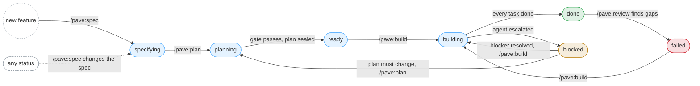

# claude-plugins

Claude Code plugins for paveforge.

Install Pave for Claude Code:

```
/plugin marketplace add paveforge/claude-plugins
/plugin install pave@paveforge
```

Install the separate Pave Installer when you want to use Pave on another
agentic coding platform (Codex or Kiro):

```
/plugin install pave-installer@paveforge
/pave-installer:install codex    # or: kiro
```

This installs one skill, `pave-setup`, for the current user. Run it in the
platform (`$pave-setup` in Codex, `/pave-setup` in Kiro): it explains Pave and
where its source is, and the platform builds its own Pave from it. The Pave
plugin itself stays Claude-specific. Remove the skill with
`/pave-installer:uninstall codex` (or `kiro`).

---

# Pave

**Specify a feature once, plan it across every service it touches, freeze the
contracts, then build each service in parallel.**

When a feature spans several services, the usual approach is to go service by
service, designing each in isolation. The cross-service picture — which
services are affected, what the interfaces between them are, what order things
ship in — never exists anywhere except in someone's head.

Pave inverts that. A **hub** folder sits beside your service repos and holds
the planning. A feature is specified and planned once, across all of it, with the contracts
between services defined and generated before any implementation starts.
Freezing the contracts is what makes the next step safe: the services stop
depending on each other's in-flight code, so they can be built at the same time
by separate agents, each working from a self-contained task document.

It is stack-agnostic. Build commands are discovered per repo — CI config
first, since that says how *your team* builds *this repo* — so nothing in the
plugin assumes a language, a framework or an architecture.

`build`, `test` and `lint` are slots meaning "does this work", not literal
compilation: a Terraform repo's are `validate`, `plan` and `tflint`, and a
Helm chart's are `template`, `test` and `lint`. Services, libraries, apps and
infrastructure are all first-class.

---

## Quick start

```bash
mkdir platform && cd platform          # the hub, beside your service repos
claude
```

```
/pave:init                             # create the hub here
/pave:add ../user-service           # register each service
/pave:add ../order-service
/pave:add ../pricing-service
/pave:analyse                          # work out what they are, and what they do
/pave:spec build checkout              # pick an id, then agree what it must do
/pave:plan                             # → one approval gate
/pave:build                            # fan out, one agent per service
/pave:review                           # did the agents follow the plan?
/pave:learn                            # record what the feature added
```

**Sharing the hub is optional.** Nothing in Pave depends on the hub being a
git repository — every hash, snapshot and staleness check works on plain
files, so a private hub that is never committed works exactly the same. To
share it with a team, commit `config.yaml`, `AGENTS.md`, `CLAUDE.md`,
`conventions/`, `.pave-hub` and `artifacts/knowledge/on-demand/`.
`workspace.yaml` stays local either way — it holds *your* repo paths, and a
teammate generates their own with `/pave:init`.

**So is git in the service repos.** Pave never reads a branch or a commit to
decide anything. The plan's task hashes record what each task was built
from, and knowledge records a hash of the source it read. In a repo
under git, builders work on a branch; in a repo without one, they build in
the folder as it is. Only `execution.monorepo_strategy: worktree` needs git.

**Commits.** With `branch.autocommit: false`, the default, builders are told
not to commit, and `/pave:build` asks at the end whether to commit what it
built. With `true`, a builder makes one commit on its branch once every task
in its queue is done and verification passes. Either way, only a repo that
had no uncommitted changes before the build is ever committed, and nothing
is merged or pushed. This is enforced by the agents' instructions, not by a
guard: a builder can run shell commands, so it is not a hard boundary.

---

## How it flows

```
spec  →  plan  →  build  →  review  →  learn
what      how      do        check      remember
```

Every feature takes the same path, and each step answers exactly one
question:

| Step | Question | Owned by |
|---|---|---|
| **spec** | What must be true when this is done? | You — nothing is written without your yes |
| **plan** | What has to change, in which services, to make it true? | The planner — one gate, your approval |
| **build** | Make the change | Builders, one per repo, in parallel |
| **review** | Did the code do what the plan said? | Reviewers, one per task |
| **learn** | What does the platform know now that it didn't before? | The knowledge base |

The philosophy is in how the steps relate:

- **Each step trusts only what the step before it wrote down.** The handoff
  is a file — `spec.md`, `plan.md`, a task document — never a conversation.
  So any step can run in a fresh session and reach the same result.
- **Change flows one way.** A new requirement starts at spec, never in a task
  or a repo. A builder that finds a gap stops; a planner that meets a "what"
  question sends it back. Nothing downstream decides what upstream left open.
- **Drift is detected, not trusted away.** The plan records the spec it
  answers and the tasks it approved, by hash. Change either, and build and
  review refuse until the feature is re-planned.
- **The loop closes.** What a feature added, and what a question dug out of
  the code, goes back into the knowledge base — so the next spec is written,
  and the next plan is made, against the platform as it now is.

---

## The workflow

| Command | When you run it |
|---|---|
| `/pave:init` | Once, to create the hub; again after upgrading Pave |
| `/pave:add <folder>` | Whenever a service joins the platform |
| `/pave:analyse` | After adding services, then as they drift |
| `/pave:spec` | Every feature — sets the session's feature, then what it must do |
| `/pave:plan` | Once the spec has no open questions |
| `/pave:build` | Once the plan is approved |
| `/pave:review` | On demand |
| `/pave:learn` | After a clean review — records the feature in the knowledge base |
| `/pave:help` | Any time you have a question about using Pave |
| `/pave:query` | Any time you have a question about your hub |
| `/pave:visualize` | Any time you want a picture instead of tables |
| `/pave:compact` | When the conversation is long — before you run `/compact` |

---

## `/pave:init` — create the hub

**What it does.** Creates the hub folder's scaffolding: `config.yaml`,
an empty `workspace.yaml`, `AGENTS.md` (plus a `CLAUDE.md` that imports it), `conventions/` and a `.pave-hub`
marker that lets every other command find the hub from anywhere.

It does not look for repos, guess what anything is, or scan. Each step does one
thing you can check before moving on.

**What it asks you.** Where the hub goes — this folder, or somewhere else. It
never guesses. If the folder isn't a git repository it offers `git init`, for
sharing the hub later - nothing in Pave needs it.

**After upgrading Pave, run it again.** On an existing hub it creates only
what is missing and leaves everything else. It runs `pave.sh config-check`,
which compares the hub's config with the template this version of Pave ships:

```
leftover  model_ranking = [haiku, sonnet, opus, fable]
leftover  agents.designer = { model: fable, effort: max }
missing   agents.planner = { model: opus, effort: high }
result: 3 to fix - run /pave:init
```

Init asks what to do - add the missing keys, remove the leftovers, both, or
nothing - and makes exactly those edits: missing keys are copied from the
template with its values, leftovers are removed, and every other line, comment
and value stays, in the file's own format (YAML or TOML). A removed key's value
is not carried over (`designer`'s model does not move to `planner` - edit the
config afterwards to keep it). The config
records no Pave version; the template is what Pave reads now, which is right
however old the hub is.

**Upgrading from 0.6.** 0.7 adds `branch.autocommit`, and builders no longer
commit by default. `/pave:build` stops until the key is in the config: run
`/pave:init` to add it as `false`, or set it to `true` to have each builder
commit once, after its build passes.

**Upgrading from 0.5.** 0.6 stops using git to decide anything, and a hub
from 0.5 notices it in three places:

- **Every service is re-analysed once.** Knowledge from 0.5 records a git
  commit, not a hash of the source it read, so `pave.sh stale` reports every
  service `missing` and the next `/pave:analyse` reads them all again. Plan
  for the cost of one full scan.
- **Every source finding is stale.** A finding from 0.5 records a commit
  too. Each is answered again, from the code, the next time `/pave:query` or
  `/pave:plan` needs it; until then it is not used.
- **Reports lose their commits.** Build and review reports record the spec
  and task hashes they ran against, not a branch head or a commit sha, and
  feature records list tasks per service instead of commits. Anything outside
  Pave that reads `commit:` from them must change.

Plans and tasks carry over as they are: a feature sealed and built under 0.5
still passes `pave.sh check`, and its `done` tasks stay done.

---

## `/pave:add` — register a service

```
/pave:add ../order-service
/pave:add ../storefront/packages/events     # a monorepo package
```

**What it does.** Records the folder's absolute path in `workspace.yaml` and
adds it to `additionalDirectories` in `.claude/settings.json` — that second
part is what actually grants Claude access to the repo.

It runs `scripts/pave.sh`, because none of that needs a model: validate,
absolutise, append, merge. The script is idempotent, so adding the same folder
twice is a no-op, and you can run it directly if you prefer:

```
"$(...)/plugins/pave/scripts/pave.sh" add ../order-service
```

That's all it records: name and path. Not the language, not the build commands.
`/pave:analyse` finds those, and having two commands discover the same things
would mean two answers.

**What it asks you.** Nothing, unless something is wrong — the folder doesn't
exist, is inside the hub, or collides with a name already registered. A
folder that isn't a git repository is registered like any other, with a note
that builders will not branch or commit there.

---

## `/pave:analyse` — work out what they are

**What it does.** Two passes over the registered services.

**Discovery** reads CI config first, then a task runner, then the manifest,
then the README, and records the language, build/test/lint commands, contracts
and repository root. That order is deliberate: a manifest tells you a repo is Go; CI
tells you how *your team* builds *this repo*, which is the question that
matters.

**Analysis** then reads each service's domain model, business flows,
integrations and data ownership, and writes an indexed knowledge base.

**Why the second pass exists.** Discovery records how to *build* a repo. It
says nothing about what a service *means*. Without that, planning writes
confident, concrete tasks that contradict code which already exists — a
`Reservation` entity in a service that has had `StockHold` for two years.
Concrete and wrong is worse than vague, because an agent will faithfully build
it.

**It never overwrites your edits.** `workspace.yaml` is yours to correct. If
you fix a test command by hand, analyse fills empty fields around it and leaves
yours alone, reporting the disagreement instead of silently winning.

**Staleness is path-scoped, not age-based.** Each service records the source
directories its analysis rested on, and `pave.sh stamp` records a hash of
their content. A month of changes to CI config invalidates nothing; a change
under `internal/domain` invalidates exactly one service. It compares file
content, not history, so it works the same with git, another VCS or none.

That check runs in `scripts/pave.sh`, which you can also run directly:

```
pave.sh stale

undiscovered svc-d       no language in workspace.yaml
missing      svc-c       no knowledge folder
stale        svc-b       files changed under internal/domain
orphan       old-svc     knowledge folder, no such service in workspace.yaml
current      svc-a       unchanged since 3f9a1c2
```

**It is the scan, nothing else.** `/pave:analyse` or `/pave:analyse
<service>`. A question is not a scan — ask it with `/pave:query`, which reads
the code only for what the question needs. A scan never rewrites or deletes
on-demand knowledge (below); it only rebuilds the index that lists it.

**You rarely run it by hand after the first time.** `/pave:plan` spawns analysts
itself for any service whose knowledge is missing or stale.

---

## `/pave:spec` — agree what the feature must do

```
/pave:spec FEAT-8888 build checkout      →  features/FEAT-8888/
/pave:spec let's build checkout page    →  asks: feat-3 | build-checkout-page | other
/pave:spec FEAT-8888                     →  resume an existing feature
```

**One feature per session, and this is the command that sets it.**
`/pave:plan`, `/pave:build` and `/pave:review` take no feature argument —
they act on the feature `/pave:spec` last set in the conversation. Picking a
feature back up in a fresh session is `/pave:spec <id>`: it loads the spec,
summarises it, and asks nothing unless something needs clarifying.

A leading ticket reference becomes the id. For a description, it proposes the
next `feat-N` and a short slug and lets you choose; nothing is created until
you do. The description becomes the feature's **title**.

**What it does.** It is an assistant for *your* job — deciding what the
feature is — not an agent producing something. It works through the why, the
behaviour, the acceptance criteria (each with a permanent id like `AC-3`), the
guardrails, what's out of scope, and what's still open. It asks when something
is unclear rather than filling the gap, and points out what is weak: an
untestable criterion, a "fast" with no number, a behaviour with no failure case.

**It writes only when you say yes.** Whenever the conversation changes scope,
a criterion or a guardrail, it stops and proposes the exact edit to `spec.md`.
Every approved write bumps the spec's version. If a plan exists, it then asks
whether to re-plan.

**What it asks you.** Everything about *what*. Nothing about *how*.

---

## `/pave:plan` — plan it across services

Always runs the `planner` agent, on the model `config.yaml` names for it.

**Is a plan needed?** It first compares the spec's hash with the one recorded
in the approved plan. Same → the plan is current, and it says so. Different →
it re-plans, starting from what changed. It refuses while the spec still has
open questions.

**What it does, in order:**

1. **Services** — which services does this touch? Usually more than the
   person asking expects. You confirm the candidates.
2. **plan.md** — the approach, a **service map** (every service as `modify`,
   `read-only` or `untouched`), each decision with the criteria it serves and
   the alternative it rejected, the flow, failure behaviour, state ownership,
   and every task in one line: service, priority, size, the criteria it
   satisfies, and the obsolete tasks it reverts.
3. **Contracts** — the interfaces between services.

   **→ The gate.** You approve `plan.md` and the contracts together.
   **Contracts freeze here.**

4. **Task documents** — one per task, each naming a single service, then a
   readiness check. The plan is then **sealed**: the spec's hash and each
   task's hash are recorded in `plan.md`.

**It never decides what the spec leaves open.** A question about *how* — an
event or a call, which service owns the state — it settles or asks you. A
question whose answer changes what the feature does goes back to you as a spec
decision: settle it with `/pave:spec`, then re-plan.

**Always tasks, even for one change.** A task is the unit that is built,
rebuilt, reviewed and reverted on its own. Task numbers only ever increase.

**Re-planning.** Tasks describe the end state, never a change from a previous
version. When the spec changes:

| The task is… | …and the spec | The plan |
|---|---|---|
| not built | still needs it, differently | rewrites it in place |
| not built | no longer needs it | drops it |
| built | still needs it, differently | rewrites it and **reopens** it, naming every place in the code the change reaches |
| built | no longer needs it | marks it **obsolete** and adds a new, high-priority task that removes its work |

**The planner reads the code.** Knowledge tells it where to look; the code
tells it what is true. It looks up precise things itself — every place a value
lives, what a handler does on failure — and hands back what it needs
explained: the skill has a cheaper `analyst` read the code and save the answer
as an on-demand finding, then resumes the planner with it. A task can only
name every place a behaviour lives if someone read the code, and that is the
planner's job, not the builder's.

**A change that affects nothing.** If the spec changed only in wording — a
typo, a clarified sentence — the planner says so and lists what it compared,
and you can **re-seal** instead of re-planning: the new spec hash is recorded,
no task is touched, and the feature goes back to the status its tasks say.
It's always your call; a changed word in a criterion counts as a change.

**Token cost.** Within a session the planner is resumed rather than
respawned, so a re-plan costs only the difference. Across sessions it
recovers from small files: `plan.md` as the index from criteria to decisions
to tasks, a snapshot of the spec it was approved against, and the list of
knowledge files and findings it relied on. A re-plan diffs the spec, follows
the index to the affected tasks, and reads knowledge and code only for their
services.

**What it asks you.** To confirm the services, any *how* questions, and the
one gate.

---

## `/pave:build` — execute the plan

```
/pave:build                  # every outstanding task
/pave:build 03,07            # only these (spaces also work)
```

**It refuses to build a stale plan.** Before anything else it checks the
spec's hash and every task's hash against the sealed plan. A spec changed
since, or a task edited by hand, stops it: run `/pave:plan`.

**What it does.** Groups the tasks by service and fans out one agent per
service. Inside each service's queue, `high` tasks — the ones removing obsolete
work — run before `low` ones, then by number; `depends_on` always comes first.

**One way of building.** Every task is built the same way, whatever its
status: for each item, the builder reads the code the item names, leaves it
alone if the item already holds, and makes it hold if not. A new task, a
reopened one, one that failed review and one that removes obsolete work are
all just items to make true.

A `done` task is frozen and never rebuilt, even when named — a task changes
only by re-planning. A done task was built from the text sealed for it, so
if a re-plan rewrites a done task without reopening it, `pave.sh seal` sees
its hash differ from the previous seal's and reopens it.

**Pave writes in the hub; builders write in the repos.** The skill itself never
touches a service repository — it reads the hub, spawns agents, and writes
reports back. Each builder owns exactly one repo: it copies the frozen
contracts in, runs codegen and then starts work - in a repo under git, on the
feature's branch. One writer per repo is what makes parallel agents safe.

**Commits.** A builder commits only if `branch.autocommit` is `true`, its
repo had no uncommitted changes before the build and no other builder works
there - and then only once, after every task in its queue is done and
`build`, `test` and `lint` pass. With `false`, the default, builders are told
not to commit; when the build ends, `/pave:build` offers to commit each repo
that was clean before the build and whose tasks are all done, and commits
only on an explicit yes.

Contracts are copied, never regenerated from the spec, so every service builds
against the same bytes.

Tasks targeting the same service run sequentially in one agent — two agents in
one repo is a write conflict. Different services run in parallel.

**What it asks you.** Ideally nothing. The build report is triaged by *who must
act*: an in-scope judgement an agent made goes under **Decisions taken**, where
you can skim it; only what genuinely cannot be resolved without you reaches
**Needs you**, and each of those carries the decision and the exact command.

**Escalation.** An agent that finds the contract wrong stops rather than fixing
it locally — other services are built against that contract, and a local fix
turns one error into several divergent guesses. That becomes a decision for
you, usually a re-plan.

---

## `/pave:review` — check the agents followed the plan

**What it does.** Spawns one reviewer per task. Each takes a single task
document and one repo, and finds every ticked item in the code — not in the
agent's report, in the code.

**What it does not do.** It does not verify the feature works, or ask whether
the plan was right. If the plan said A, B and C and the agents did A, B and
C, it passes — even if the feature needs D. A missing case is a planning
problem, so it goes in the report as a comment and you decide.

That restraint is the point: it makes the phase cheap, and it keeps your
approval at the plan gate meaningful. Like build, it refuses to run against a
plan that no longer matches the spec.

**When something deviates**, review unchecks the specific items that were not
real, unticks those items, marks that task `failed`, and writes a report for
you. `/pave:build` then re-runs only the failed tasks; each builder sees only
its task document, where the failed items are unticked.

**Cleaning up.** After a successful review, if any obsolete tasks have been
reverted, it asks whether to remove them. On yes, `pave.sh
prune-obsoleted-tasks` deletes each obsolete task together with the task that
reverted it (from the `Reverts` column of `plan.md`) and drops their hashes from `plan.md`, leaving the spec hash and every
other task untouched.

---

## `/pave:help` — how do I use Pave

Not part of the sequence above. Run it any time, from anywhere — it needs no
hub.

```
/pave:help
/pave:help plan
/pave:help how does /pave:review decide a task failed?
```

**What it does.** Explains a command, or the workflow as a whole, straight
from the plugin's own skill files — no hub, no agent, just a handful of
small local files. With no argument it lists every command and what it does
in one line. Given a command name, it explains that phase in plain language.

Ask it something about *your* hub instead — a service, a feature, a
convention — and it declines and points you at `/pave:query`, rather than
guessing at an answer it has no way to check.

**What it asks you.** Nothing.

---

## `/pave:query` — ask about your hub

Not part of the sequence. Run it any time, once you have a hub.

```
/pave:query what happens after an order is submitted?
/pave:query why did build-checkout end up blocked?
```

**What it does.** Answers as cheaply as the question allows:

1. A `retriever` answers from the knowledge base — service analyses, earlier
   on-demand findings, feature records — plus `conventions/` and the hub's
   `AGENTS.md`, citing the file each fact came from.
2. If that can't answer a question about **how the code behaves**, an
   `analyst` reads only the code the question needs, across services, and
   answers with file and line references.
3. That answer is saved as a **source finding** in
   `artifacts/knowledge/on-demand/source/`, so the next person to ask gets it
   from knowledge.

A finding records the directories it read and a hash of their content, and
`pave.sh stale` marks it stale as soon as that code changes. A stale finding is never used as
an answer; the next query that needs it reads the code again and replaces it.

A gap reading code can't settle — a decision nobody recorded, a convention
nobody wrote — is reported as such, never guessed.

**What it asks you.** Nothing.

---

## `/pave:learn` — record a finished feature

```
/pave:learn
```

**What it does.** Acts on the session's feature. Once it has been built and
passed review against its current plan — the plan matches the spec, every task
is done, every acceptance criterion is satisfied by a done task, and the review
is of this build — it writes a **feature record** to
`artifacts/knowledge/on-demand/features/<feature-id>.md`: what the feature
added, per service with the tasks built there, its contracts, the decisions a
later feature will bump into, and links back to `features/<feature-id>/`.

Its capabilities join the knowledge index, so the next spec in the same area is
planned against what this one added.

The record stores the spec hash it was made against. Once the feature's
`spec.md` changes, `pave.sh stale` marks the record stale and it stops being
used as an answer or planned against, until the feature is re-planned,
rebuilt, reviewed and learned again. If the feature isn't finished, it refuses
and lists what's missing and which command fixes it.

**What it asks you.** Nothing.

---

## `/pave:visualize` — draw a picture

Also not part of the sequence. Run it any time.

```
/pave:visualize                            # the session feature's blast radius
/pave:visualize build-checkout             # another feature's
/pave:visualize how does pricing talk to checkout?   # freeform
```

**What it does.** Given a feature id, or none when the session has one,
draws that feature's blast radius — services from its `plan.md` service map as
nodes, its Flow steps and Contracts as edges. Given anything else, treats it as a description and pulls what's
relevant from the knowledge index.

It draws only from files other phases already wrote — never from scanning a
service repo — and says plainly when something needed is missing or stale
rather than filling the gap.

Where Claude's Artifact tool is available it publishes an interactive
diagram and gives you the link; otherwise it writes a self-contained
`diagram.html` you open locally.

**What it asks you.** What to draw, if you ran it with no argument.

---

## `/pave:compact` — compact without losing your place

Also not part of the sequence. Run it when the conversation gets long.

```
/pave:compact
/pave:compact keep the two options we discussed for retries
```

**Why it exists.** The session's feature lives in the conversation — the
`Working on <id> — <title>` line `/pave:spec` printed. A plain `/compact`
can summarise that line away, and then `/pave:plan`, `/pave:build` and
`/pave:review` stop with "No feature in this session".

**What it does.** Writes a short *Pave brief*: the feature line, verbatim;
the feature's state as its files say it (`README.md` status and `pave.sh
check`); a few lines of recent work; and whatever is not on disk yet — a spec
edit you have not approved, a question still open. Then it gives you the
`/compact` command that keeps the brief word for word. A skill cannot run
`/compact` itself, so you run it.

The brief is memory, not a source of truth. After compacting, every command
still re-reads the spec, plan and tasks from disk; the brief only tells them
which feature, and you where you were.

**What it asks you.** Nothing. An argument is anything else you want kept.

---

## The hub

```
platform/
├── config.yaml              team policy — commit this
├── workspace.yaml           your services — gitignored, local to you
├── AGENTS.md                your rules — every agent is given this
├── CLAUDE.md                @AGENTS.md — so Claude Code loads it too
├── conventions/             how code is written, by language and service
│   ├── README.md
│   └── go.md
├── artifacts/               disposable, except knowledge/on-demand/
│   ├── knowledge/           what each service does, indexed
│   │   └── on-demand/       kept by every scan — cannot be regenerated
│   │       ├── source/      answers /pave:query read from the code
│   │       └── features/    what each finished feature added, from /pave:learn
│   ├── diagram.html         written by /pave:visualize when freeform
│   └── platform.code-workspace
└── features/
    ├── README.md            portfolio: one row per feature
    └── build-checkout/
        ├── README.md        one row per task
        ├── spec.md          what it must do — yours
        ├── plan.md          how, plus the spec and task hashes
        ├── contracts/       frozen at the plan gate
        ├── tasks/           one self-contained document per unit of work
        └── artifacts/       spec snapshot, planner context, reports, diagram.html
```

`config.yaml` holds nothing machine-specific, so it commits and the team shares
it. `workspace.yaml` holds absolute paths, which differ per developer — a
teammate clones the hub and builds their own with `/pave:add`. That split is
what lets everyone share one policy with their own local layout.

---

## Status


```mermaid
flowchart LR
    newfeat(("new feature")) -->|/pave:spec| specifying(["specifying"])
    specifying -->|/pave:plan| planning(["planning"])
    planning -->|gate passes, plan sealed| ready(["ready"])
    ready -->|/pave:build| building(["building"])
    building -->|every task done| done(["done"])
    building -->|agent escalated| blocked(["blocked"])
    blocked -->|blocker resolved, /pave:build| building
    blocked -->|plan must change, /pave:plan| planning
    done -->|/pave:review finds gaps| failed(["failed"])
    failed -->|/pave:build| building
    any(["any status"]) -.->|/pave:spec changes the spec| specifying

    classDef step fill:#54aeff26,stroke:#54aeff,stroke-width:1px
    classDef good fill:#2da44e26,stroke:#2da44e,stroke-width:1px
    classDef warn fill:#bf871926,stroke:#bf8719,stroke-width:1px
    classDef bad  fill:#cf222e26,stroke:#cf222e,stroke-width:1px
    classDef muted fill:none,stroke:#8c959f,stroke-dasharray:3 3
    class specifying,planning,ready,building step
    class any,newfeat muted
    class done good
    class blocked warn
    class failed bad
```

| Status | Means | What to do |
|---|---|---|
| `specifying` | The spec is being written, or changed since it was last planned | `/pave:plan` once it has no open questions |
| `planning` | Planning in progress | — |
| `ready` | Plan approved and sealed, not built | `/pave:build` |
| `building` | Being built, or a run left work | `/pave:build` resumes |
| `done` | Every task built | `/pave:review` if you want it checked |
| `failed` | Review found claims that were not real | `/pave:build` re-runs those tasks |
| `blocked` | An agent escalated | Read the build report. `/pave:build` once the blocker is fixed; `/pave:plan` if the plan must change; `/pave:spec` first if what the feature does must change |

A spec change sends the feature back to `specifying` from any status: build
and review refuse until it is re-planned. `/pave:learn` does not change the
status; it records a `done`, reviewed feature in the knowledge base.

Tasks have their own status: `pending`, `in-progress`, `done`, `reopened`
(re-planned after it was built), `failed`, `blocked`, and `obsolete` (no longer
wanted; a new, high-priority task removes its work).

---

## Configuration

`config.yaml` — team policy, committed:

```yaml
agents:
  analyst:   { model: sonnet, effort: medium }   # reads business logic
  builder:   { model: sonnet, effort: medium }   # executes one task document
  explorer:  { model: haiku,  effort: low    }   # mechanical repo scanning
  reviewer:  { model: sonnet, effort: low    }   # one per task: plan vs code
  planner:   { model: opus,   effort: high   }   # planning decides the feature
  retriever: { model: sonnet, effort: low    }   # answers hub questions

execution:
  mode: parallel                 # parallel | sequential
  monorepo_strategy: sequential  # sequential | worktree | shared-tree
  max_parallel: 4

branch:
  pattern: feature/{feature-id}  # the branch in every service repo under git
  autocommit: false              # true: builders commit once, after every task passes
```

Every model is enforced when its agent is spawned, planning included. Skills
look each one up with `pave.sh agent <name>` rather than parsing YAML.
`/pave:plan` always spawns the `planner` on its configured model, and resumes
the same agent for later stages and re-plans within a session.

Agent definitions carry no `model` or `effort`. The orchestrating skill always
passes both when it spawns, so `config.yaml` is the only place to change them.
There are no defaults anywhere else. If an agent has no entry, `pave.sh agent`
stops with an error, and a skill that needs a setting the config lacks stops
too; both point you to `/pave:init`, which brings the config up to date.
Commands never change the config themselves.

**What the platform can enforce.** Pave passes both values, but the agent
platform decides what it honours. In Claude Code the model is enforced when an
agent is spawned; whether `effort` is depends on your Claude Code version, and
where it is not supported the agent runs at the platform's default effort. Use
the model names your platform accepts for spawned agents - in Claude Code,
`haiku`, `sonnet`, `opus` or `fable` - rather than full model IDs.

The hub's config may be `config.yaml`, `config.yml` or `config.toml`, but only
one of them. `pave.sh` reads it with `scripts/yaml-reader` or
`scripts/toml-reader`, both Python 3. The YAML reader uses PyYAML when it is
installed, and otherwise a built-in parser that rejects any syntax it doesn't
support rather than guessing. The TOML reader uses Python 3.11's `tomllib`.
Either reader can be called directly:

```
scripts/yaml-reader config.yaml agents.explorer
model=haiku
effort=low
```

A config file that can't be parsed stops the command with an error rather than
falling back to defaults.

**Monorepos.** When several services share a repo, `execution.monorepo_strategy` decides
whether their tasks run one at a time (the template's choice, safe), in separate git
worktrees (parallel, costs disk, needs git - build refuses it for a repo
without), or concurrently in one checkout (fastest, will eventually collide).

---

## Your own rules

The hub's `AGENTS.md` is yours. `/pave:init` creates it, and **every agent Pave
spawns is given it by path as required reading** — the builder writing code in
a service repo, the reviewer checking it, the analyst and explorer reading a
repo, the planner planning the feature. Write a rule there and it reaches the
agent doing the work, not only the session that spawned it.

The hub also gets a one-line `CLAUDE.md` — `@AGENTS.md` — because Claude
Code loads `CLAUDE.md` by itself and not `AGENTS.md`. Your rules go in
`AGENTS.md`; the `CLAUDE.md` only points at it. On a hub from an older
version, `/pave:init` offers to move rules from `CLAUDE.md` into `AGENTS.md`.

Skills read it explicitly rather than relying on it being loaded for them —
they run from inside service repos as well as from the hub, and a file loads by
itself only when you happen to be standing next to it.

| Where | What belongs there |
|---|---|
| hub `AGENTS.md` | Your rules — what agents should and should not do |
| `conventions/` | How code is written, by language and service |

The split is worth learning once: `conventions/` is **descriptive** — drafted
by `/pave:analyse` from your repos, narrowed to a language or a service. The
hub file is **prescriptive** — what you are telling the agents to do.

Nothing you write there relaxes the plugin's own doctrine. A rule cannot send a
builder into another repo, edit a frozen contract, or let it fill a gap the
plan left open, and it cannot make a reviewer fail a task the plan never asked
for. Where one of your rules and a task document disagree, the document wins
and the agent says so in its summary rather than quietly picking.

---

## Why it holds together

**The user owns "what"; the plan owns "how".** The spec is written only with
your approval, and the planner sends back any question whose answer would
change what the feature does. So every plan decision traces to something you
wrote down.

**Nothing is built against a stale plan.** The plan records the spec's hash
and every task's hash at its gate; build and review check both before doing
anything. A spec change or a hand-edited task stops them until the feature is
re-planned.

**Planning is the expensive phase and gets the strong model.** Build agents
get a cheaper one — not because they do the same job with less care, but
because their job is genuinely smaller: contracts are frozen, tasks are
concrete, out-of-scope is explicit, and anything ambiguous escalates instead of
being improvised.

**Every task traces in both directions.** Tasks cite the plan sections and
contracts they come from and the acceptance criteria they satisfy, and the
planner checks coverage every way: no task without a decision behind it, no
decision without a task, no criterion without a task that satisfies it. The
missing ones are the expensive ones — a criterion with no task is never built,
and review will pass the feature, because review asks whether the plan was
followed and the plan never asked.

**Tasks describe the end state.** A re-planned task is rewritten, not
patched with a diff, so any builder — facing existing code or starting from
a reset — reaches the same result from the document alone.

**Unhappy paths are specified, not left open.** A task item that changes
behaviour states what happens on replay, on failure, and at boundaries. This is
where agents invent, and review is structurally unable to catch an invention
the plan never ruled out.

**Silence never means success.** An agent that returns nothing leaves its work
unfinished, not done — in build, in review, and in analyse alike.

If build agents routinely need to think their way out of gaps, that is a defect
in the plan, not a reason to raise the build model.
